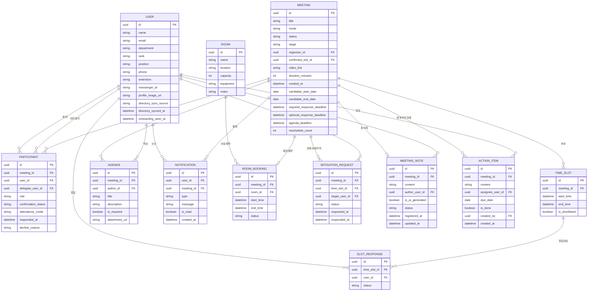

# 데이터 모델 — MVP (v1)

> 12개 엔티티: USER, MEETING, PARTICIPANT, TIME_SLOT, SLOT_RESPONSE, AGENDA, NOTIFICATION, ROOM, ROOM_BOOKING, MITIGATION_REQUEST, MEETING_NOTE, ACTION_ITEM
> (회의실 관리·회의록/향후 추진 과제는 원래 v2 예정이었으나 각각 회의 모드 자동계산 흐름에 필수적이라는 이유, 그리고 통합 재검토 단계의 승격 결정으로 MVP(v1)로 앞당김. `MITIGATION_REQUEST`는 완화요청(변경요청) 큐/이력을 저장하기 위해 통합 재검토에서 신설)
> 현재 v2로 연기된 항목 없음 — 향후 확장 필요 시 별도 문서로 관리

## ERD

## 엔티티 상세

### USER
| 필드 | 타입 | 제약 | 설명 |
|---|---|---|---|
| id | uuid | PK | |
| name | string | not null | |
| email | string | not null, unique | |
| department | string | nullable | 부서 |
| rank | string | nullable | 직급 (예: 대리, 과장) |
| position | string | nullable | 직책 (예: 팀장) |
| phone | string | nullable | 휴대폰 |
| extension | string | nullable | 내선번호 |
| messenger_id | string | nullable | 메신저 ID |
| profile_image_url | string | nullable | 프로필 사진. 없으면 이름 첫 글자로 이니셜 아바타 표시. 최초 프로필 설정 시 SSO/Google 계정 사진을 기본값으로 가져옴 |
| directory_sync_source | string | nullable | 부서·직급·직책 값을 자동 동기화하는 소스 시스템(예: "HRIS", "SSO그룹속성") — 이 값이 있으면 department/rank/position은 항상 읽기 전용 |
| directory_synced_at | datetime | nullable | 위 필드들의 최종 동기화 시각 |
| onboarding_seen_at | datetime | nullable | 온보딩(간단 사용법, 화면 15) 최초 노출 시각 — 값이 있으면 로그인 시 온보딩을 다시 보여주지 않음 |

### MEETING
| 필드 | 타입 | 제약 | 설명 |
|---|---|---|---|
| id | uuid | PK | |
| title | string | not null | |
| mode | string | nullable | 온라인 / 오프라인 / 하이브리드 — **주최자가 미리 정하지 않음.** 필수 참석자 응답이 모이면 자동 계산되어 채워짐 (그 전까지 null). 참석자 개인 단위의 `attendance_mode`(대면/온라인/무관)와는 다른 필드이므로 dev-note·구현 시 "오프라인"(이 필드) vs "대면"(`attendance_mode`) 용어를 혼용하지 않도록 주의 |
| status | string | not null | 제안중 / 확정 / 재조율중 / 취소 |
| stage | string | not null | 필수응답중 / 선택확인중 / 확정 — `status`='제안중'일 때의 세부 진행 단계 |
| organizer_id | uuid | FK → USER | 주최자 |
| confirmed_slot_id | uuid | FK → TIME_SLOT, nullable | 확정된 시간 (같은 meeting_id의 TIME_SLOT만 가능, 앱 레벨 검증) |
| video_link | string | nullable | 화상회의 링크. 모드에 온라인 요소가 있으면 확정 시 자동 생성 |
| duration_minutes | int | not null | 회의 길이(분). **주최자가 회의 생성 시 직접 입력하는 가변값**(최대 480분/8시간, 5분 단위) — 과거 "고정 1시간" 전제를 폐기하고 정식으로 가변 길이를 지원하기로 확정. `TIME_SLOT.end_time`은 `start_time + duration_minutes`로 계산 |
| created_at | datetime | not null, 자동 생성 | 모든 기간 계산의 기준 시점 |
| candidate_start_date | date | not null | 회의 후보 기간 시작일 — 주최자가 회의 생성 시 **캘린더에서 직접 선택** |
| candidate_end_date | date | not null | 회의 후보 기간 종료일 — 마찬가지로 캘린더에서 직접 선택 |
| required_response_deadline | datetime | not null | 필수 참석자 응답 마감 상한선. `created_at`부터 `candidate_start_date` 전날까지의 영업일 수(N) 중 1/5 지점 |
| optional_response_deadline | datetime | not null | 선택 참석자 확인 마감 상한선. 위 N의 2/5 지점 |
| agenda_deadline | datetime | not null | 안건 등록 마감 |
| reschedule_count | int | default 0 | 확정 후 재조율 발생 횟수. 자동 1회 + 수동 2회, 총 3회 한도를 실제로 강제(§ 스키마 레벨 비즈니스 규칙 참고) |

> `location`(비정규화 장소명) 필드는 통합 재검토에서 **제거 확정** — 실제로 이 필드를 직접 읽는 화면이 없고 전부 `ROOM_BOOKING → ROOM.name`/`ROOM.location` JOIN으로 조회하므로, 스키마를 단순화하기 위해 별도 저장하지 않음.

### PARTICIPANT
| 필드 | 타입 | 제약 | 설명 |
|---|---|---|---|
| id | uuid | PK | |
| meeting_id | uuid | FK → MEETING | |
| user_id | uuid | FK → USER | |
| delegate_user_id | uuid | FK → USER, nullable | 대리 참석자. `MEETING.status`='확정' 이후에만 값 설정 가능 (앱 레벨 검증) |
| role | string | not null | 필수 / 선택 / **주최자** — `screen_specs.md`에서는 이미 사용 중이었으나 이 문서엔 누락되어 있던 값을 추가(주최자는 항상 필수 참석자로도 취급되며, 이 값은 화면에서 배지 등으로 구분 표시할 때 사용) |
| confirmation_status | string | default '미확인' | 미확인 / 확정 / 불참. 압축 후보 전부에 "불가"로 답한 선택 참석자도 '불참'으로 기록. **'확정'은 회의 시간이 최종 확정되는 순간 시스템이 전체 확정 참석자에게 자동으로 기록**(화면 9의 "참석으로 변경"은 그 이후의 예외적 재전환 경로) |
| attendance_mode | string | nullable | 대면 / 온라인 / 무관. **화면 3(슬롯 응답)에서는 시간대 그리드 응답 다음 순서로 선택**(회의당 1회, 날짜별 아님), 마감 전까지 언제든 재수정 가능하며 재수정 시 `MEETING.mode` 재계산 트리거. 마감까지 미응답이면 '무관'으로 기본 처리. `MEETING.mode` 자동 계산의 입력값이자, 확정 후 참석 재확인 단계에서 재사용되는 필드 |
| responded_at | datetime | nullable | "응답 완료" 버튼을 누른 시각. 해당 단계 대상자 전원이 값을 가지면 마감 전이라도 다음 단계로 조기 진행 |
| decline_reason | string | nullable | 참석 재확인 화면(8)에서 "불참 통보" 시 입력하는 사유(자유 텍스트, 필수 입력). 화면 12의 자동 불참 처리에는 적용 안 됨 |

### MITIGATION_REQUEST (신규 — 통합 재검토에서 추가)
| 필드 | 타입 | 제약 | 설명 |
|---|---|---|---|
| id | uuid | PK | |
| meeting_id | uuid | FK → MEETING | |
| time_slot_id | uuid | FK → TIME_SLOT | 완화(변경) 요청 대상이 되는 후보 시간 |
| target_user_id | uuid | FK → USER | 요청 대상자(하드 제약을 건 당사자) |
| status | string | not null | 대기 / 수락(가능으로 변경) / 유지(불가로 유지) |
| requested_at | datetime | not null | |
| responded_at | datetime | nullable | |

완화요청 순차 알고리즘은 **사람 기준**(하나의 `time_slot_id`에 대해 여러 `target_user_id`에게 순서대로 요청)으로 화면 6·7 전체 통일. 이 엔티티가 도입되기 전에는 화면 6·7이 하드코딩된 JS 배열로만 이력을 표시했음.

### MEETING_NOTE (신규 — v2에서 v1로 승격, 화면 10)
| 필드 | 타입 | 제약 | 설명 |
|---|---|---|---|
| meeting_id | uuid | PK, FK → MEETING | 회의 1건당 회의록 1건(1:1) |
| content | string | nullable | 회의 내용 본문 |
| author_user_id | uuid | FK → USER | 현재 지정된 작성자(기본값 주최자, 주최자가 재지정 가능). 편집 권한은 이 사용자 1인에게만 있음 |
| is_ai_generated | boolean | default false | 마지막 저장이 AI 초안 생성 결과를 반영한 것인지 |
| status | string | not null, default '임시저장' | 임시저장 / 등록. '등록'으로 바뀌는 시점에 참석 인원 전체에게 `NOTIFICATION`(type: 회의록등록) 발송 |
| registered_at | datetime | nullable | '등록' 전환 시각 |
| updated_at | datetime | not null | |

### ACTION_ITEM (신규 — v2에서 v1로 승격, 화면 10 "향후 추진 과제")
| 필드 | 타입 | 제약 | 설명 |
|---|---|---|---|
| id | uuid | PK | |
| meeting_id | uuid | FK → MEETING | |
| content | string | not null | |
| assignee_user_id | uuid | FK → USER, nullable | 담당자 |
| due_date | date | nullable | 마감일 |
| is_done | boolean | default false | |
| created_by | uuid | FK → USER | |
| created_at | datetime | not null | |

편집(추가·완료체크·삭제)은 `MEETING_NOTE`의 작성자 권한 제한과 무관하게 참석자 누구나 가능.

### TIME_SLOT
| 필드 | 타입 | 제약 | 설명 |
|---|---|---|---|
| id | uuid | PK | |
| meeting_id | uuid | FK → MEETING | |
| start_time | datetime | not null | |
| end_time | datetime | not null | |
| is_shortlisted | boolean | default false | 필수 참석자 응답 마감(조기 포함) 시점에 상위 5개로 압축된 후보 표시. 선택 참석자에게는 이 값이 true인 슬롯만 노출 |

### SLOT_RESPONSE
| 필드 | 타입 | 제약 | 설명 |
|---|---|---|---|
| id | uuid | PK | |
| time_slot_id | uuid | FK → TIME_SLOT | |
| user_id | uuid | FK → USER | |
| status | string | not null | 가능 / 기피 / 불가 |

레코드가 없는 (time_slot_id, user_id) 조합은 애플리케이션 레벨에서 기본값 "가능"으로 처리한다.

### AGENDA
| 필드 | 타입 | 제약 | 설명 |
|---|---|---|---|
| id | uuid | PK | |
| meeting_id | uuid | FK → MEETING | |
| author_id | uuid | FK → USER, not null | 작성자 |
| title | string | not null | |
| description | string | nullable | |
| is_required | boolean | default false | 필독 여부 |
| attachment_url | string | nullable | |

> "순서 변경" 기능은 통합 재검토에서 **스펙 제외로 확정**(등록순으로만 표시) — 별도 순서 필드는 추가하지 않음.

### NOTIFICATION
| 필드 | 타입 | 제약 | 설명 |
|---|---|---|---|
| id | uuid | PK | |
| user_id | uuid | FK → USER, not null | 수신자 |
| meeting_id | uuid | FK → MEETING, not null | 관련 회의 |
| type | string | not null | 안건등록 / 안건수정 / 안건삭제 / 시간확정 / 재조율 / 완화요청 / 참석재확인 / 마감임박 / 회의실확정 / **불참안내** / **응답요청** / **회의록등록** (마지막 3개는 통합 재검토에서 추가 확정) |
| message | string | not null | 표시 문구 |
| is_read | boolean | default false | |
| created_at | datetime | not null | |

화면 표시 시 내부 `type` 값을 그대로 노출하지 않는다 — 예: `type`='완화요청'인 알림은 화면에서 "변경요청"으로 표시(데이터 값은 유지, 표시 라벨만 매핑). "응답요청"·"마감임박" 알림 클릭 시 이동 대상은 **수신자의 해당 회의 내 역할**에 따라 분기: 필수 참석자 → 슬롯 응답 화면(3), 선택 참석자 → 압축 후보 확인 화면(12), 주최자 → 회의 대시보드(5). "참석재확인" 알림은 반드시 참석 재확인 화면(8)으로 라우팅(과거 화면 9로 잘못 연결되던 버그 수정 완료).

### ROOM
| 필드 | 타입 | 제약 | 설명 |
|---|---|---|---|
| id | uuid | PK | |
| name | string | not null | 회의실 이름 |
| location | string | nullable | 위치(건물·층) |
| capacity | int | nullable | 수용 인원 |
| equipment | string | nullable | 보유 장비 |
| notes | string | nullable | 특이사항(예: "화이트보드 있음") — 예약 화면(17)의 회의실 상세 패널에서 사용 |

### ROOM_BOOKING
| 필드 | 타입 | 제약 | 설명 |
|---|---|---|---|
| id | uuid | PK | |
| meeting_id | uuid | FK → MEETING | |
| room_id | uuid | FK → ROOM | 자동 매칭으로 결정 (인원수 충족 + 해당 시간 비어있음) |
| start_time | datetime | not null | |
| end_time | datetime | not null | |
| status | string | not null | 확정 / 취소 |

`MEETING.status`가 '확정'으로 바뀌는 시점에만 생성된다. 후보 평가 단계에서는 조회만 하고 레코드를 만들지 않는다.

## 관계 요약
| 관계 | 카디널리티 | 설명 |
|---|---|---|
| USER — PARTICIPANT | 1:N | 한 사용자가 여러 회의에 참여 |
| USER — PARTICIPANT (delegate) | 1:N | 한 사용자가 여러 건의 대리 참석을 맡을 수 있음 |
| MEETING — PARTICIPANT | 1:N | |
| MEETING — TIME_SLOT | 1:N | |
| MEETING — AGENDA | 1:N | |
| USER — AGENDA (작성) | 1:N | |
| USER — NOTIFICATION (수신) | 1:N | |
| MEETING — NOTIFICATION (발생) | 1:N | |
| USER — SLOT_RESPONSE | 1:N | |
| TIME_SLOT — SLOT_RESPONSE | 1:N | |
| ROOM — ROOM_BOOKING | 1:N | |
| MEETING — ROOM_BOOKING | 1:0..1 | |
| MEETING — MITIGATION_REQUEST | 1:N | |
| USER — MITIGATION_REQUEST (대상) | 1:N | |
| MEETING — MEETING_NOTE | 1:0..1 | |
| USER — MEETING_NOTE (작성) | 1:N | |
| MEETING — ACTION_ITEM | 1:N | |
| USER — ACTION_ITEM (담당) | 1:N | |

## 스키마 레벨 비즈니스 규칙

**응답수집 단계**
- 참석자 응답은 역할별로 단계적으로 진행됨: ① 필수 참석자 전체 그리드 응답 → ② 시스템이 상위 5개 `TIME_SLOT`을 `is_shortlisted=true`로 압축 → ③ 선택 참석자에게 압축된 후보만 노출해 가능/불가 확인
- 각 단계 마감(`required_response_deadline`, `optional_response_deadline`)은 **상한선**일 뿐, 해당 단계 대상자 전원이 `responded_at`을 갖게 되면(= "응답 완료" 버튼 클릭) 마감 전이라도 즉시 다음 단계로 진행
- 선택 참석자가 압축된 후보(5개) 전부에 "불가"로 답하면 완화요청·재조율을 트리거하지 않고 `confirmation_status`='불참'으로만 기록, 진행은 그대로

**기간 분리**
- 주최자는 회의 생성 시 **캘린더에서 `candidate_start_date`~`candidate_end_date`를 직접 선택**한다 (회의 후보 기간)
- 응답수집 기간(`created_at` ~ `candidate_start_date` 전날)과 회의 후보 기간(`candidate_start_date` ~ `candidate_end_date`)은 서로 다른 날짜 범위 — 후보가 응답 도중 지나버리는 문제 방지
- `TIME_SLOT`은 `candidate_start_date`부터 `candidate_end_date`까지 **30분 단위 시작 시각**으로 생성됨(생성 간격 자체는 계속 30분 단위 유지). 각 `TIME_SLOT`의 `end_time`은 더 이상 "고정 1시간 뒤"가 아니라 **`start_time + MEETING.duration_minutes`**로 계산(회의 길이가 주최자별로 가변이기 때문 — 통합 재검토에서 구조 확정). 주말 제외 — 후보 기간이 주말로만 구성되면 슬롯이 0개 생성될 수 있으므로, 회의 생성 화면에서 후보 기간에 평일이 최소 1일 포함되도록 검증한다
- `candidate_start_date`는 `created_at`으로부터 **최소 3영업일 이후**여야 함 (응답수집 단계가 무의미해지지 않도록 하는 하한선). 캘린더에서 이보다 이른 날짜는 선택 불가

**회의 모드 자동 계산 (신규)**
- `MEETING.mode`는 주최자가 미리 정하지 않는다. 필수 참석자 전원이 `attendance_mode`를 응답하면(조기 진행 포함) 자동 계산. 판단 기준은 **'온라인'을 선택한 인원이 있는지 여부가 우선**이며, '무관'은 어느 쪽으로도 강제하지 않는 중립표로 취급한다:
  - **'온라인'을 선택한 사람이 한 명도 없으면 → 오프라인** ('대면'과 '무관'이 섞여 있어도 동일하게 적용 — 온라인 참석을 요구하는 사람이 없으므로 대면 기준으로 확정)
  - '온라인'을 선택한 사람이 있고 '대면'을 선택한 사람이 없으면 → **온라인** ('무관'이 섞여 있어도 동일)
  - '온라인'을 선택한 사람과 '대면'을 선택한 사람이 **모두 1명 이상씩** 있으면 → **하이브리드**
  - 전원 '무관'인 경우도 위 첫 번째 규칙(온라인 선택자 0명)에 자연히 포함되므로 별도 규칙이 아니라 **오프라인**으로 계산됨(기본값이 아니라 규칙의 자연스러운 결과)
- 선택 참석자의 `attendance_mode`는 모드 재계산에 반영되지 않음 (본인이 압축 후보에 참석 가능한지 판단하는 데만 사용)

**회의실 자동 예약 (신규 — 원래 v2였으나 MVP로 승격)**
- 계산된 모드가 오프라인 또는 하이브리드인 경우에만 회의실이 필요
- 후보 평가 단계(압축된 5개 슬롯)에서는 각 슬롯 시간에 전체 참석자 수를 수용하는 `ROOM`이 비어있는지 **조회만** 하고 `ROOM_BOOKING`은 생성하지 않음
- 최종 `confirmed_slot_id`가 정해지는 순간, 해당 시간·인원 기준으로 회의실을 자동 매칭해 `ROOM_BOOKING` 생성 + (온라인 요소가 있으면) `video_link` 자동 생성 → 결과를 주최자에게 요약 전달, 주최자가 승인하거나 변경 가능
- 적합한 회의실이 없으면 주최자에게 알리고 재선택 요청 → 그래도 없으면 시간만 확정하고 온라인으로 전환 (`video_link` 자동 생성)

**기존 규칙**
- `SLOT_RESPONSE`가 없는 슬롯 = 기본값 "가능" (레코드 자체를 만들지 않음)
- 안건이 등록·수정·삭제되면 **작성자 본인을 제외한** 나머지 참가자 전원에게 `NOTIFICATION` 생성 (type: 안건등록/안건수정/안건삭제)
- 탭바 "알림" 아이콘에는 `is_read=false`인 `NOTIFICATION`이 1건 이상 있으면 빨간 점 배지 표시 (개수 표시 아님, 존재 여부만)
- `MEETING.confirmed_slot_id`는 반드시 같은 `meeting_id`를 가진 `TIME_SLOT`을 가리켜야 함
- `PARTICIPANT.delegate_user_id`는 `MEETING.status`가 '확정' 이후에만 설정 가능
- **재조율 횟수 제한 (자동 1회 + 수동 2회, 총 3회) 실제 강제**: `MEETING.reschedule_count`가 0→1(자동)로 처음 증가한 이후에는 이후 재조율이 전부 수동 처리로 전환된다. `reschedule_count`가 3에 도달하면(자동 1 + 수동 2) 더 이상 재조율을 진행하지 않고 담당자 에스컬레이션으로 전환 — 이전 버전 문서의 "≥2가 되면 수동 전환"이라는 기준은 실제 온보딩된 "자동1+수동2=3회 한도" 규칙과 불일치했던 표현이라 이번에 정정
- 최종 확정 슬롯 선택 알고리즘은 하드 제약을 통과한 후보 중 `unavailCount`(소프트 선호 기준 불편도) **최소값 기준**으로 통일 — 화면 5의 "강제 진행" 버튼도 동일 알고리즘을 사용해야 함(과거엔 배열 순서상 첫 하드패스 후보를 고르는 별도 로직이 있었으나 폐기)
